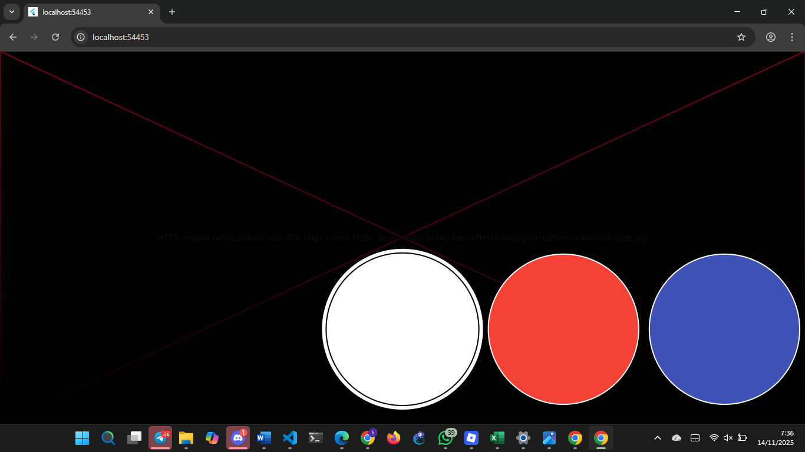

# filter

A new Flutter project.

Maksud void async pada praktikum 1

Dalam Dart, kata kunci async digunakan untuk menandai bahwa sebuah fungsi bersifat asynchronous. Artinya, fungsi tersebut dapat menjalankan proses yang membutuhkan waktu (misalnya mengambil data dari internet, membaca file, delay, dan lainnya) tanpa menghentikan program utama.
Jadi void async = fungsi asynchronous yang tidak mengembalikan nilai apapun.

@immutable adalah anotasi dari package Flutter (foundation.dart) yang menyatakan bahwa sebuah class tidak boleh diubah setelah dibuat, artinya:

> Semua variabel di dalam class harus final
> Nilai property tidak boleh dimodifikasi setelah objek dibuat.

## Getting Started

This project is a starting point for a Flutter application.

A few resources to get you started if this is your first Flutter project:

- [Lab: Write your first Flutter app](https://docs.flutter.dev/get-started/codelab)
- [Cookbook: Useful Flutter samples](https://docs.flutter.dev/cookbook)

For help getting started with Flutter development, view the
[online documentation](https://docs.flutter.dev/), which offers tutorials,
samples, guidance on mobile development, and a full API reference.
